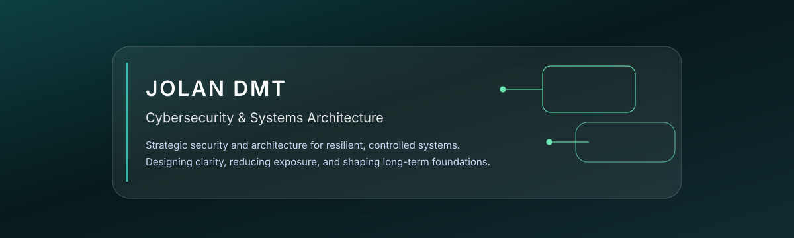
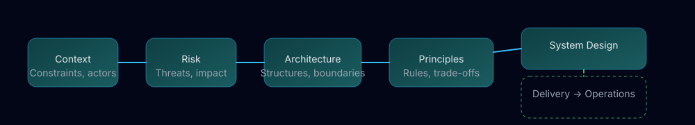
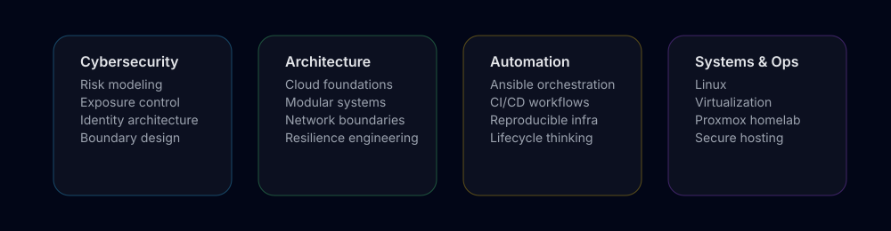

---

## Architecture Concept Map

  

**Method**  
A systemic, risk-driven approach to design and evolve infrastructure:

- Make risk and constraints explicit before building.  
- Align architecture with operations from day zero.  
- Prefer simple, defensible structures over fragile complexity.

---

## Security Mindset

- Reduce exposure through structural design choices.  
- Control complexity before scaling anything.  
- Make threat-driven decisions, not tool-driven ones.  
- Automate consistency and verification of baselines.  
- Use observability as a primary security signal.  
- Build minimal, defensible, and maintainable systems.

---

  

---

## Tech Stack Overview

<table>
  <tr>
    <th>Cloud & Infra</th>
    <th>Security</th>
    <th>Automation</th>
    <th>Observability</th>
  </tr>
  <tr>
  <td>

 
 

  </td>
  <td>

 
 

  </td>
  <td>

 
 

  </td>
  <td>

 
 

  </td>
  </tr>
</table>

---

## GitHub Stats

---

## Current Focus

- Designing secure, private-cloud style environments at personal scale.  
- Refining automation for deterministic, rebuildable infrastructure.  
- Bringing architecture thinking to every layer: network, systems, and cloud.  
- Documenting and structuring knowledge for long-term technical growth.

---

## Links

- Portfolio (photography): https://photo.jolandmt.com  
- Cyber consulting: https://cyber.jolandmt.com 
- LinkedIn: https://linkedin.com/in/jolandemottie